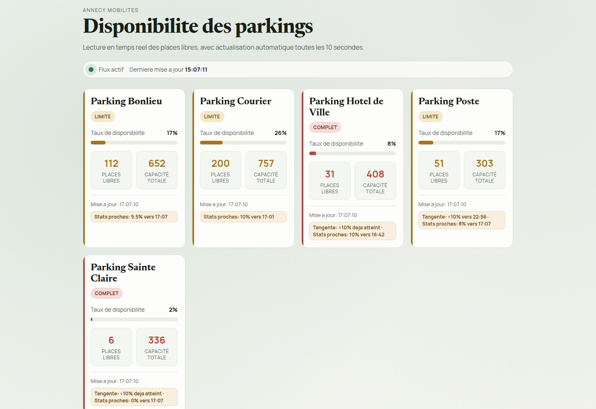
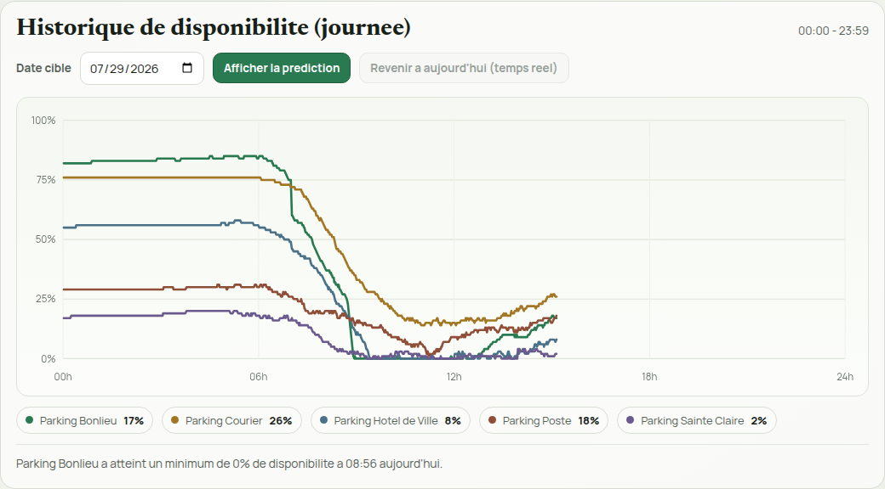

<div align="center">

# 🅿️ AnnecyPark

**Ce parking sera-t-il plein quand vous arriverez ?**

Dashboard temps réel de la disponibilité des parkings d'Annecy, avec
historique persistant et prédiction de remplissage pour une date et une
heure données.

### 👉 [**park.remcorp.fr**](https://park.remcorp.fr) 👈

</div>

<br>



## Pourquoi cet outil ?

Les applis officielles affichent la disponibilité *actuelle* d'un parking,
mais pas ce qu'elle sera dans une heure, ni si ce niveau est normal pour
un vendredi 18h en période de vacances scolaires. AnnecyPark enregistre
l'historique de chaque parking en continu et l'utilise pour répondre à
deux questions concrètes : *« Où en sera ce parking à l'heure où je pense
arriver ? »* et *« Dans combien de temps ce parking va-t-il passer sous
10 % de places libres ? »*

## Fonctionnalités

- 🔄 **Disponibilité en temps réel**, actualisée toutes les 10 secondes
- 💾 **Historique persistant** en SQLite, avec courbe de la journée dans
  l'interface
- 🔮 **Mode prédiction** : pour une date choisie, une courbe estimée basée
  sur les semaines précédentes (pondération par récence, segmentation
  vacances scolaires / hors vacances), avec retour instantané au mode
  temps réel
- ⏱️ **Estimation du seuil critique** (`<10 %` de places libres) par
  régression sur les 15 dernières minutes, ou par comparaison au profil
  statistique habituel de l'heure
- 🧹 **Nettoyage automatique des anomalies** (chutes brutales à 0 %
  clairement aberrantes), au démarrage et à la demande



## Lancer en local

### Prérequis

- Node.js 20+
- npm

### Commandes

```bash
npm install
npm start
```

Application disponible sur http://localhost:3000

### Avec Docker Compose

```bash
docker compose up --build
```

- Application sur http://localhost:3000
- Base SQLite persistante dans le dossier `./data`

## API

### `GET /api/parkings`

Retourne l'état courant des parkings et enregistre un échantillon en
SQLite (max 1 échantillon/minute).

### `GET /api/history/day?date=YYYY-MM-DD`

Retourne l'historique de la journée :

```json
{
  "date": "2026-04-17",
  "points": [
    {
      "timestamp": "2026-04-17T10:31:00.000Z",
      "parkings": {
        "bonlieu": {
          "name": "Parking Bonlieu",
          "available": 245,
          "occupied": 407,
          "maxCapacity": 652,
          "percentage": 38
        }
      }
    }
  ]
}
```

### `GET /api/stats/typical?parkingKey=bonlieu&hour=14&weekday=5`

Retourne des stats horaires historiques pour un parking, segmentées
`schoolHoliday` / `nonHoliday`.

### `GET /api/prediction/day?date=YYYY-MM-DD`

Retourne une courbe journalière estimée selon le contexte du jour choisi
(jour de semaine + vacances scolaires).

Stratégie de pondération par récence sur les mêmes jours de semaine :

- semaine -1 : 25 % (+ semaine équivalente N-1)
- semaine -2 : 25 %
- semaine -3 : 25 %
- semaine -4 : 10 %
- semaine -5 : 15 %

Re-normalisation automatique des poids quand certaines semaines n'ont pas
de données, filtrage sur le contexte vacances/hors vacances.

### `GET /api/stats/eta-full?parkingKey=bonlieu`

Estimation d'atteinte du seuil `<10 %` selon deux approches :

- `tangent` : projection depuis la valeur actuelle par régression linéaire
  sur les 15 dernières minutes (uniquement si la pente est négative)
- `nearestBelowThresholdStat` : valeur statistique `<10 %` la plus proche
  de l'heure courante

`hasPrediction` vaut `true` si au moins une des deux approches fournit une
estimation.

### `POST /api/history/cleanup-anomalies`

Relance manuellement le nettoyage rétroactif des anomalies (supprime les
0 % uniquement si la valeur précédente était nettement au-dessus de 0).

## Configuration

- `PORT` (défaut : `3000`)
- `SQLITE_PATH` (défaut : `./data/parking_history.db`)
- `TZ` (recommandé : `Europe/Paris`)

## Structure

```
.
├── Dockerfile
├── docker-compose.yml
├── server.js
├── package.json
├── public/
│   ├── index.html
│   ├── styles.css
│   └── script.js
└── data/
    └── parking_history.db (créé automatiquement)
```
